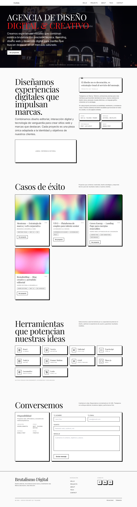

# 🖤 Brutalismo Digital — Portafolio



Portafolio personal desarrollado con **Next.js** + **Tailwind CSS** y animaciones **Framer Motion**, con estética **neubrutalista** inspirada en diseño editorial suizo.  
Incluye secciones de presentación, proyectos destacados, tecnologías, contacto funcional y microinteracciones basadas en scroll.

## 🚀 Características

- 🎨 **Estética brutalista**: monocromo con acentos, tipografía editorial y sombras duras.
- ⚡ **Animaciones suaves** con [Framer Motion](https://www.framer.com/motion/) y efectos `whileInView`.
- 🖥 **Diseño responsive** mobile-first, optimizado para todos los tamaños de pantalla.
- 🧱 **Arquitectura modular**: componentes desacoplados y reutilizables.
- 📜 **Formulario de contacto funcional** con validación en cliente/servidor y envío vía Resend o SMTP.
- 🖼 **Optimización de imágenes** con `next/image` y carga progresiva.
- ♿ **Accesibilidad**: etiquetas ARIA, focus states visibles, contraste alto.

## 🛠 Stack técnico

- **Framework:** [Next.js 15](https://nextjs.org/)
- **Estilos:** [Tailwind CSS 3](https://tailwindcss.com/)
- **Animaciones:** [Framer Motion 12](https://www.framer.com/motion/)
- **Iconos:** [lucide-react](https://lucide.dev/)
- **Validación:** [Zod](https://zod.dev/)
- **Email:** [Resend](https://resend.com/) o [Nodemailer](https://nodemailer.com/)
- **Tipografía:** [Playfair Display](https://fonts.google.com/specimen/Playfair+Display) y [Inter](https://fonts.google.com/specimen/Inter) vía `next/font`

## 📂 Estructura del proyecto

app/
├─ api/
│ └─ contact/
│ └─ route.ts # API de envío de formulario
├─ layout.tsx # Layout raíz con fuentes y estilos globales
├─ page.tsx # Página principal
components/
├─ Navbar.tsx
├─ Hero.tsx
├─ AboutMe.tsx
├─ MyWorks.tsx
├─ Technologies.tsx
├─ Contact.tsx
├─ Footer.tsx
public/
├─ img/works/ # Imágenes de proyectos
└─ screenshots/ # Capturas para README
styles/
└─ globals.css
tailwind.config.ts
package.json

## 📦 Instalación y ejecución local

1. **Clonar repositorio**

```bash
git clone https://github.com/tuusuario/brutalismo-digital.git
cd brutalismo-digital
```

2. **Instalar dependencias**

```bash
npm install
# o pnpm install / yarn install
```

3. **Configurar variables de entorno**
   Crea un archivo `.env.local` en la raíz con las variables necesarias según tu proveedor de email. Ejemplo para **Resend**:

```env
CONTACT_PROVIDER=resend
RESEND_API_KEY=tu_api_key_de_resend
CONTACT_FROM=Portfolio <contact@tudominio.com>
CONTACT_TO=tu-email@dominio.com
```

4. **Ejecutar en desarrollo**

```bash
npm run dev
```

La app estará disponible en [http://localhost:3000](http://localhost:3000).

## 📤 Despliegue

Compatible con [Vercel](https://vercel.com/) (recomendado) y cualquier entorno que soporte Next.js.

### Desplegar en Vercel

- Importa el repositorio desde tu cuenta de Vercel.
- Añade las variables de entorno en el panel de Vercel.
- Haz deploy y Vercel gestionará la compilación y CDN de assets.

## 🧪 Contacto y pruebas

Para probar el formulario de contacto:

- Rellena los campos y envía.
- Revisa el email configurado en `CONTACT_TO`.
- En entorno de desarrollo, la API simulará un envío (puedes ver logs en consola).

## 📄 Licencia

Este proyecto está bajo licencia MIT.
Puedes usarlo, modificarlo y distribuirlo libremente, manteniendo la atribución.

## ✨ Autor

Desarrollado por [Oslar](https://oslarcode.es/) — Diseño y desarrollo web brutalista.
